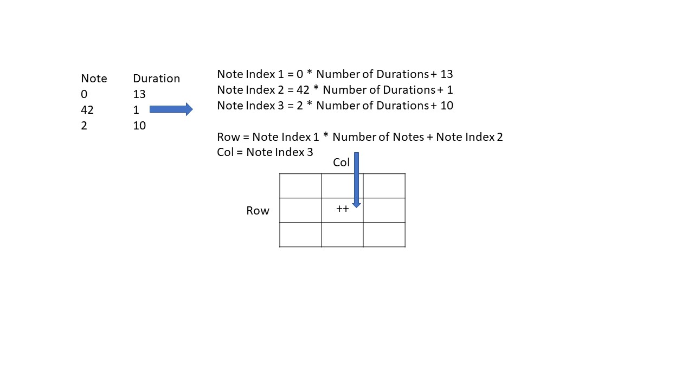
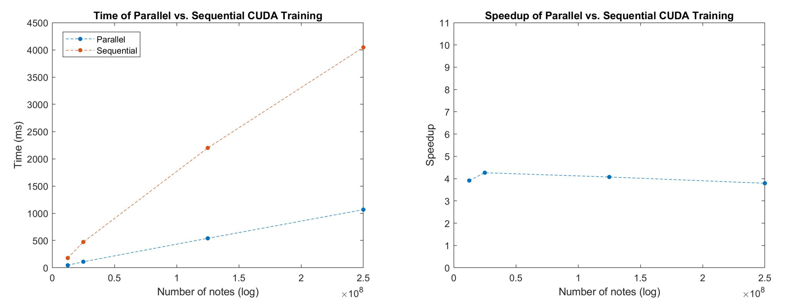
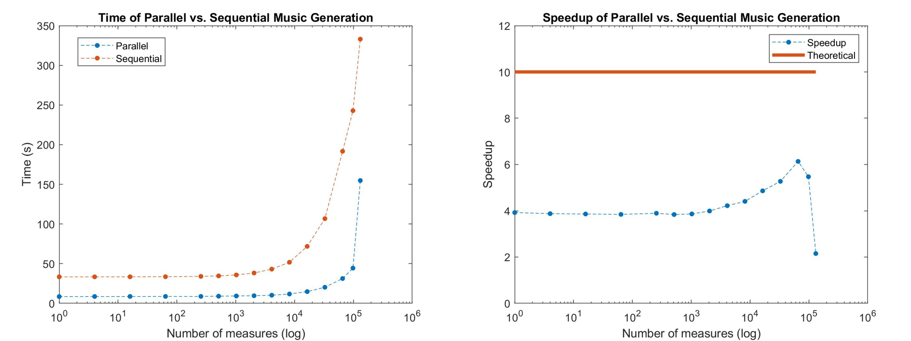

# Summary

Most video games use static soundtracks, which although can be impressive in their own right, can quickly become overplayed to the gamer. In this project, we built a complete system that can process, learn, and generate new video game music. Our system takes in 11 thousand MIDIs of video game music, which are processed and trained into a Markov Model using a CUDA algorithm that utilizes 14 NVIDIA Tesla K80 GPUs. We then use our trained Markov Model to generate a 10-voice music samples through multi-processing. Finally, we build a client interface, which interacts with the music generation server through websockets, to demonstrate the variety of custom options for generating music that are possible with our system. Speedup analysis shows that our training performs 4 times faster than a sequential algorithm, and our music generation performs 6 times faster than a sequential algorithm. Our resulting system, which not only shows fast live music generation, but also the ability to custom music on the spot, suggests that video games in industry could integrate a similar music generation system as created in this project to introduce real-time soundtrack generation as a way to make  video games more unique and exciting.


# Background

## Musical Theory

Through the forms and rules outlined in music theory, humans already follow many rigid guidelines when composing music. For example, there are basic rules of tonality and music structure that can decide whether a piece of music sounds good or clashing to the ear (Joutsenvirta). Therefore, it seems natural to extend these music theory rules to build an algorithmic composer. In particular, the genre of video game music, which in the early 1970s and 80s was originally designed for auxiliary reasons, such as a "heart rate changer" (NPR), and was limited in technology to 8-bit sound (Collins, 2007), is often characterized by a repetitive and structured format, which is ideal as a starting point for algorithmic composers.

On the other hand, in modern times, video game music has evolved to serve a larger purpose in the gaming experience. For example, Whalen discusses how music in the 2001 horror game Silent Hill has many qualities that are similar to film music. Modern game soundtracks have become more complex, and often features the overlapping of multiple melodic lines as they are composed for multi-instrument ensembles such as an orchestra (Collins 2008). Fortunately, these multiple melodic lines offer ample avenues for parallelization, allowing for parallel synthesis of different parts. In addition, the rigid structure makes such music easier to predict and generate with a Markov Model — resulting in higher quality and more harmonious music (Schulze 2011).

The Markov Model of music generation was chosen for its popularity, good musical results, and ease of implementation. The model is easy to understand and implement, as it is based on using many probability matrices to determine the next notes of a melodic line, which is how notes progress in music, as certain notes are more likely to come after C, for example. Other music generation algorithms introduce too many new challenges, such as the recursive nature of Grammars (which may be difficult as it is not known beforehand how may recursions/threads we would need to spawn), or the poor music production of Structure and Probability techniques (Dannenberg, 2018). Finally, it has been shown that Markov Models produce good musical results, where computer compositions and human compositions had similar rankings in formal listening tests (Elowsson and Friderg, 2012). Therefore, implementing a Markov Model for our project is the best choice for producing music with integrity and quality.

## Key Data Structures and Operations

In a Markov Model, multiple matrices are built from training data, or files of music that fit the patterns and genre of the music we wish to create. This takes the form of counting the number of transitions from one note to another, and storing this count in a matrix. In our case, for the case of major and minor, we produce a total of 3 matrices:

1. High melodic line
2. Low melodic line
3. Chords

For melodic line matrices, notes are stored as a pair of `(tone, duration)`, where the tone represents a musical tone ranging from 0 to 72. In particular, 0 is mapped to C2, 71 is mapped to B6, and 72 maps to a rest, or silence in music. The duration maps to an array containing a variety of common rhythms, such as sixteenth notes, quarter notes, and whole notes, and indicates how long a note is played.

In order to have more complex decisions in music generation, the melodic line matrices are of depth 2, meaning that the rows are identified by the last two previous notes, rather than just the previous, which is what most Markov Models use. The rows are indexed by `(prevNote, currNote)` pairs and the columns indexed by `(nextNote)`, where a value of x in this matrix cell means that a total of x transitions were counted where `nextNote` was preceded by `prevNote` and  `currNote` in that order. During training, the indices are flattened to be stored in a row-major matrix. Upon output, these matrices are printed to a space-delimited text file.

For chord matrices, chord are stored in base 12, because there are 12 notes per octave, where the highest pitched note in the chord is in the most significant digit. Chords also have no duration marker, since they are usually indicators of context or mood in a music piece, rather than a moving line that has short parts within the piece. The chord matrix has depth 1, meaning rows and columns are both indexed by single notes. Like melodic line matrices, indices are mapped to be stored in a row-major matrix, and printed to a text file.

### Training


During the training phase, the 6 Markov matrices are first initialized to 0, indicating that no transitions have been observed. Then, we run our CUDA portion of the code, which has GPU threads step through the MIDI data, where they perform `atomicAdd()` operations on the corresponding cells according to note transitions. The major operations on the above matrices are memory loads and stores between the GPU devices and the host, `atomicAdds` on the GPUs, and the final print and store performed by the CPU to a text file. Because of the size of the melodic line matrices, they are split between 3 GPUs each, where each GPU stores a contiguous block of the original matrix. When copying their data back to the CPU, these 3 GPUS load their respective blocks in parallel.

### Generation

In the music generation step, we want to generate up to a 10-voice music sample. The way we generate each melodic line, is our algorithm uses the previous 2 notes to determine the transitions we are interested in, which correspond to a row in the transition matrix. Then, using the frequency of notes in the row as weights, we can choose an index in the row based on its weighted probability.

Because the matrices are training on music of the same structure and genre, it is likely that the resulting melodies also follow the same structure and sound similar to the training pieces. The resulting melodies are then combined and sent over to the client. Music is stored in nested lists, which has the following structure:

```Python
[
    # First melodic line
    [
        [note1, duration1],
        [note2, duration2],
        [note3, duration3],
        ...
        [noteN, durationN]
    ],
    # Next melodic line...
]
```

Each part line in the music is generated in parallel, through Markov Chain evolution. This results in many computationally and time expensive operations, since we have large matrices and need to normalizing rows.

## Algorithm Input and Outputs

Our pipeline consisted of the following stages:

1. Preprocessing:
    - Input: Raw MIDI files (1 GB)
    - Output: text files containing an encoding of the MIDI data (200 MB)
2. Training:
    - Input: Text files from preprocessing (200 MB)
    - Output: Markov matrices trained from music samples (40 GB)
3. Generation:
    - Input: Markov matrices (40 GB)
    - Output: Generated music (1 MB)
4. Client:
    - Input: User Settings (1 kB)
    - Output: Server-generated music (1 MB)

## Parallelism Benefits and Dependencies

### Benefits of Parallelism per section:

Only steps 2 and 3 in the pipeline had computationally expensive operations, and thus could benefit from parallelism. We analyze each of them below:

1. **Matrix generation:**
    - The main computational expense is to parse through the large amounts of data generated by the thousands MIDI files, and count every note transition. However, each transition is independent of the others, and the correct matrix index for each transition can be computed in parallel. This leads to a huge parallelism benefit, as essentially every line in the input file can be computed on in parallel as opposed to sequentially by each line.
    - In addition, because we are generating 6 different matrices that are independent of one another, we can take advantage of parallelism even further by assigning different GPUs to different matrices.
2. **Music generation:**
    - Multiple melodic lines can be synthesized in parallel, allowing for faster generation of music through multi-processing. The music for each part is computationally expensive to generate, and the many different parts makes the sequential algorithm slow. As parts are mostly independent, we can use parallelization between parts to speed up this process.

### Challenges and Dependencies

Because of the complex formatting of MIDI files and the difficulty in extracting the information we needed, we decided to use the `music21` library to pre-process our MIDI data into usable text file formats. However, since `music21` does not support parallelism, we were not able to optimize this step.

During matrix generation, while we split the input files among many threads, different sections of the file could have the same transitions. As threads are updating the same matrix, this leads to possible contention. However, because of the size of these matrices due to the large number of possible transitions, these contentions will be infrequent and occur between a minimal number of threads, which means parallelism will not incur high contention costs. Theoretically, we could parallelize updating every single note transition in the input files, and every thread would only need to compute the matrix index for one transition. However, the time needed to load matrices onto GPUs and back would vastly dominate any parallelism benefit. Therefore, the amount of parallelism is balanced by the cost of loading both the input music notes and output matrices. Similarly, while matrix entries are independent, every entry must see the entire input note line in order to calculate the correct number of transitions. Therefore, the benefit of independent updates is hindered by the cost of loading and counting the input files.

Since it is impossible to predict the transitions that appear in the input, there is very low locality in matrix access - there is no way to pre-load the entry we wish to increment. The input file is stepped through in sequential order, so there is some locality there. In addition, a row-major ordering for the matrices was used as during music generation, we must normalize and read from a row at a time. A row-major ordering helps increase locality in that step. Finally, SIMD execution is not helpful, as much of the computation relies on casing (casing on the previous notes, the current note, etc.) and so would be dominated by divergent execution.

Although there are avenues for parallelization as seen above, music has many inherent synchronous components that make it difficult to parallelize. For example, even if melodic lines can be computed in parallel, they need to sound harmonious when played together. Therefore, we assigned a maximum of 10 differing melodic lines to the music generation algorithm, limiting the amount of parallelization. This also drove our choice to use multi-processing instead of CUDA for this section, as there will only ever be a maximum of 10 threads running at a time. Similarly, we generate a few measures of music at a time before synching, both to give time for the transfer to the client and to synchronize the music. In terms of locality, the row major ordering of the matrices allow for better locality, since we need to compute on a row at a time. Also, certain threads will only access certain matrices, as each musical part will only be computing on one particular matrix. However, the random nature of the accesses means there is no way to pre-load any particular row. Again, SIMD execution will be hurt by divergent execution, as much of the note generation relies on casing on previous notes.

# Approach/Implementation

Our project consisted of four major portions:

1. __Preprocessing__: preprocessing MIDI files for easier training parsing.
2. __Training:__ building a Markov Model based on input music samples.
3. __Generation:__ using the Markov Model that was trained to generate music.
4. __Client:__ takes in custom user input and requests music generation from the server, which it plays to the user.

We used two machines for our project

1. __AWS Machine:__ 64 Xeon Phi CPUs, 16 NVIDIA Tesla-K80 GPUs, 768 GB of RAM. Used for training and generation. Needed to have CUDA and multi-threading capabilities.
2. __Personal Laptop:__ Dell XPS, used as the client for requesting music from the AWS machine. Did not need any special requirements except for internet, display and keyboard.

## Training

### Preprocessing

Before we can do any training, we need to preprocess our MIDIs into a format our training algorithm can easily parse, since MIDIs themselves are very complicated, and contain many components that we do not need, for example annotations, instrumentation, tempo markings, etc. For this step, since we did not make any optimizations, we just ran the `music21` library with some custom-written functions to encode MIDI files into text; the program ran for around 24 hours.

### Markov Model - `CUDA` and `C++`

Markov Model training was done on the AWS Machines using C++ and CUDA capabilities. A total of 14 NVIDIA Tesla-K80 GPUs were used during training.

In order to accommodate the large matrix sizes, matrices were first assigned to separate GPUs. However, in order to utilize even more of the GPUS, the larger melodic line matrices were split into 3 parts each (row-major) and assigned to separate GPUs. This results in an assignment of 3 GPUs per melodic line matrix plus 1 GPU per chord matrix, for a total utilization of `3 * 4 + 2 = 14` GPUs. Next, sections of the input notes arrays were assigned to threads, again through contiguous rows (lines). Since all threads were operating independently and the input files are 1-dimensional, the assignment of threads to thread blocks is not used.

During optimization, we attempted to use asynchronous queuing of kernel operations and `memcpy` and pinned memory. This allowed us to parse the input text file on the CPU while the GPUs performed kernel operations. However, we noted that the increase in pinned memory allocation time (10.31 seconds to allocate pinned memory on the host) and CUDA allocation time (9.5 seconds) was not worth the decrease in transfer time (8.7 seconds down to 0.01 seconds). In addition, this use of queuing `memcpy` and pinned memory did not impact the transition counting runtime. Therefore, we ultimately decided against using pinned memory and reverted to a slower transfer time but faster initial allocation setup.

Previous iterations of the algorithm attempted to use shared memory between threads in the same block to increase the speed of matrix access. Since shared memory is faster, we attempted to assign matrices to thread blocks as opposed to GPUs, to cut down on transfer and access times. However, the large size of our matrices prevented this option. Besides matrix memory accesses, the work of different threads would be fully independent, and so not rely on any block structures. In addition, because of the large size and relative randomness of memory accesses in threads, there is no way to predict accesses or increase locality through assigning thread blocks or otherwise breaking down the matrix.

Another attempted optimization was the use of locks as opposed to `atomicAdd`. However, as the increment operations were unlikely to have much contention, it was much better to use atomicAdd as opposed to setting locks or other methods.

Another optimization was using peer-to-peer memory access between GPUs, in order to better parallelize the input file between more threads. However, like in the issues with pinned memory, the sheer size of the matrices combined with the random memory access pattern made any attempt at peer-to-peer memory access result in long runtimes. In addition, the input file is relatively small in comparison to the matrix size, and so further parallelization over the input file which did not take into account the matrix size was ultimately negligible. In the input files used for testing, which were many times the size of the original file, this approach may have resulted in better parallelism. However, for the purposes of generating a correct matrix from the smaller sized input files, this approach was not fruitful.

There was no previous code for this algorithm, and the original serial algorithm mapped well to a parallel machine using the techniques above. Since it was very simple (step through every line of an input file and increment a matching matrix entry), there was not much room for change.

## Generation

### Server - `multiprocessing` in Python

In order to write the server-client interface in a more straightforward manner, we decided to use Python. While this would impact our overall performance, we decided the added difficulty in getting a proper server-client link using other languages, which is irrelevant to parallelism, would be too much extra work. The server and multi-processing music generation is done on the AWS machines. We used the Python `multiprocessing` and `numpy` libraries, as well as the `pickle` library.

To use multiprocessing, we mapped every part of the music to a separate processor. Then, each processor was in charge of loading the correct matrix, then using that matrix to generate some number of measures of music. Since the only area of parallelism is between parts of the music, we have no further way of mapping to threads or blocks.

Our first implementation of this algorithm used CUDA. There, each of the parts was assigned a different thread, and the matrices were loaded onto the global GPU memory to be used by the threads. However, since we only have 10 parts in total, this is a vast waste of our many thread and multi-GPU system. In addition, the overhead of transferring to the GPU a huge matrix vastly dominated the generation of a few measures of music.

Next, we attempted to implement this algorithm with multi-threading. However, because there is only one CPU, this did not parallelize well. In fact, this algorithm has about the same runtime as a sequential algorithm. This was most likely due to the fact that this portion of the project is CPU-computation bound, rather than i/o bound, which therefore cannot be improved on one CPU.

During optimization, we looked at the matrix loading times. Originally, by loading text files, we had loading times of 8 minutes per matrix. However, through pre-processing with `pickle`, we were able to serialize a `numpy` object, which eliminated the need for `numpy` preprocessing, and allowed us to load all 6 matrices in about 30 seconds. Even after this optimization, our server was slow at responding to requests, as music generation ran for about a few seconds - too long for a client to wait. This drove our use of multiple processors, as then each processor can load only the matrix they need to use instead of all 6, which drastically reduces the loading time. In addition, they can also compute their own melodic line in parallel with other processors.

There was no previous code for this algorithm, and the original serial algorithm mapped well to a parallel machine using the techniques above. Since it was very simple (step through each part and randomly generate next note), there was not much room for change.

### Client

The client takes in user input to build a music request to the server. After requesting music, it plays back the music that the server generates. This is run on our personal laptops, and is not the focus of parallelism.

For the client, we focused on a smooth UX feel and a modern vibe. To implement our client, we used mostly frontend technologies, including:

- `Tone.js`: to play music
- `React`: framework
- `Webpack`: project building tool

# Results

## CUDA Training

### Experimental Setup

For training, we first noted that there are certain portions of the algorithm which are inherently sequential. In order to get a better understanding of how our parallel implementation impacts runtime, we attempted to isolate this sequential portion. Therefore, we first initialized at  memory usage and parsed the input text files into usable arrays. After this parsing, we passed these arrays into both CUDA and sequential counting algorithms. 

In order to verify proper isolation of the parallel portion of the algorithm, we also collected runtime data on the initialization and GPU-CPU transfer steps. These times remained constant across all input file sizes as seen below, verifying our isolation.

| | Allocating Host Memory | Allocating Device Memory	| Parsing File and Counting Transitions | Copying to Host	| Free Memory | Total |
| --- | ---  | --- | --- | --- | --- | --- |
| Parallel Pinned	| 10.31047	| 9.545223|	3.361578|	0.013167|	4.644862|	27.8753|
|Parallel Unpinned|	1.398417	|3.524767	|3.370691	|7.993404	|0.049685|	16.336964|
|Sequential|	0.000051	|0	|8.501543	|0	|0.045188|	8.546782|

For our algorithm, we considered both pinned and unpinned memory for our CUDA memory allocations. The difference between the two types of allocations is that pinned memory uses optimizations that help make copying data to the host extremely fast, but on the other hand, has a high overhead of setting up. In the table above, the pinned implementation, although having a very fast copying to host time, suffered from a setup time that made unpinned memory faster to use. In addition, unpinned memory had a faster time to free memory, since it used standard `malloc()` instead of the pinned `cudaHostAlloc()`.

In terms of areas to improve, the sequential algorithm spends almost all of its time parsing and counting transitions. We broke down this operation into two main components:

1. Reading the input files
2. Adding note transitions to the matrix

Unfortunately, reading the input files has to be done sequentially, because I/O on the disk is slow. We considered breaking up the file into smaller chunks and using multiple processors to read "in parallel", but found that the I/O speed limitations were the main factor, rather than any computation done by the CPU. Therefore, the main area to improve was adding note transitions to the matrix, which is what our CUDA algorithm was optimizing.

### Speedup Graphs



### Impact of Problem Size

As the number of notes increased, we see that speedup was relatively stable at around 4. This is because both runtimes are increasing sequentially. In particular, because we did not increase the number of threads between runs, this shows that we are utilizing all threads at maximum capacity - leading to the linear runtime increase of the parallel algorithm.

If our problem size was smaller, we see that the large initialization and matrix copying times, which are constant, would dominate the overall runtime. Therefore, the overall speedup would not be worth it.

Even though our graphs do not show increased speedup, we note that we could potentially get more speedup with more GPUs or threads. Like noted above, the constant initialization times would become less relevant as the transition counting time dominates the algorithm.

### Speedup Limitations

As stated above, the linear increase in runtime points to the idea that we are using all threads. Therefore, with an increased thread count, we may be able to see better speedup, especially in larger data sets.

In addition, since we offload our work onto GPUs, there is a fixed constant transfer time, as seen in the above table. This limits our speedup, although since the time is constant, this will become negligible with larger data sets.

Overall, the algorithm of updating note transitions is inherently O(N), which means we expect to see a linear scaling of time as our input size increases. We observe this in our results, as seen in the graphs above. The theoretical speedup is O(N), because in an ideal setup, every note transition could be updated in parallel. However, as there is contention, limits in memory transfer times, memory access, and even just parsing note transitions, the variety of computation and hardware costs make this theoretical speedup almost impossible.

## Music Generation

### Experimental Setup

For music generation, we wanted to test our parallel implementation of `generateNotes()` against a sequential version. The function `generateNotes()` generates 10 voices, each using a soprano, bass, or chord matrix as a Markov Chain to generate its notes.

Because the Markov generation is inherently sequential, we aimed to test how well we were able to parallelize the process of generating all the voices in parallel. In order to test this, for the sequential algorithm, the process was:

1. Load matrices
2. For each number of measures to test, run `generateNotes()` 10 times
3. Take the average of all 10 runs per number of measures

For the parallel algorithm, since each process would load the matrix it needed on its own, we just timed the `generateNotesParallel()` function as a whole for each number of measures.

For both the sequential and parallel tests, we used a voice vector specifier of:

```
[0, 0, 1, 1, 2, 2, 0, 0, 1, 2]
```
where the numbers denote a:

- `0`: chord line
- `1`: bass line
- `2`: soprano line

### Speedup Graphs



### Impact of Problem Size

Initially, from a problem size of 1 to 1,000 measures, the speedup is constant around 4. The reason the speedup does not increase too much here is that the problem size is very small, so the overhead of multiprocessing dominates, and parallelism is not very evident.

Starting from a problem size of 1000 all the way until 50,000 measures, the speedup steadily increases until around 6. The reason the speedup caps at 6 is due to 2 reasons:

1. Because chord matrices are much smaller than note matrices by about 1000 times, their computation time is much smaller than generating music using the note matrices, the speedup is mostly dominated by the computation time of the note matrices. Incidentally, in the test problem we chose, we had 4 chord lines and 6 melody lines.
2. The cost of transferring memory between processors is high, since the resulting notes generated by each processor is very large.

After 50,000 measures, the speedup goes down. This is due to the increase in communication costs from returning the large amounts of generated music to the master CPU, which begins to dominate.

### Speedup Limitations

Because we were doing speedup over processors, we had limitations in:

1. __Number of Processors:__ If there are less than 10 processors, then not every voice will be assigned solely to a processor. This means that a single processor has to generate multiple voices, which will cause significant slowdown in the problem, since one voice will have to wait until a processor is finished with its current voice.
2. __Problem definition:__ We only support 10 voices in our music generation. In each voice, since we use a Markov Chain to generate notes, which is a sequential process, there is no parallelism possible there. Therefore, the maximum speedup we should expect is 10.
3. __Memory transfer:__ Since we did each voice computation on a different processor, which all have different memory spaces, we had to combine all the results into one memory space at the end. This step can have limitations in hardware, where the way the CPUs are connected will have a maximum bandwidth.

## Machine Choice

For our project, we used two machines:

- AWS p2.xlarge instance
- Dell XPS laptop

### AWS Instance

The most computationally intensive parts of our project included the training and music generation algorithms. We noted that for the training, we had to perform a large number of simple actions, i.e. updating a cell of a matrix, so we found CUDA to be a good fit for that operation. In addition, since we had a very large problem size, we wanted to utilize multiple GPUs. For music generation we knew that music rarely has more than 20 voices at once, so the parallelism wouldn't be very effective on something like a GPU. Therefore, a CPU was a good choice for this step, where we still wanted some parallelism, but didn't want to invoke the high cost of a GPU if we weren't going to utilize all of its threads. For both of these steps, having a large RAM was very important, as the Markov matrices combined to use over 40GB of memory. Finally, for taking care of client requests, we needed a machine that could act as a server and respond to requests from the internet. 

Therefore, we needed a machine that had internet capabilities, had many GPUs, CPUs, and plentiful of RAM. AWS was the perfect option to fit all these needs.

### Dell XPS

The client side did not need to have many capabilities, besides internet access and a display for users to interact with. In addition, there are frontend technology requirements, but those can all be installed relatively easier. Therefore, the hardware specifications were not too stringent. However, for a better web client experience, we wanted the display to be high resolution, and the Dell XPS has a good monitor to support sharp images.

# Conclusion

We created a real-time video game music generator from scratch, which handles preprocessing, training, generation, and interacting with clients. During our optimization process, we explored a variety of parallelism techniques involving multithreading, asynchronous operations, and preprocessing. After our work, we found implementations that worked best, and were able to create speedup in both model training by 4 times and generation by 6 times. We also used multiple forms of parallelism throughout our project, each suited to a special need, which helped us optimize our algorithms.

# Future Work

A major goal of video games is to give the gamer an immersive experience in the virtual world. One common feature is realistic graphics and physics in the game. A feature that has been seldom explored is dynamic music that adapts to the context of the game. A possible extension of our project is to integrate our music generation algorithm into a video game, where the algorithm not only uses trained data, but also the current state of the video game to generate music. Such dynamically-generated music would have a similar effect to how soundtracks in movies are synchronized to actions. Such synchronized soundtracks are very effective, because they would allow for the game sound to be a form of live feedback to the gamer.

# References

- Collins, Karen (2008). Game sound: an introduction to the history, theory, and practice of video game music and sound design. MIT Press. pp. 112–118. ISBN 0-262-03378-X.
- Collins, Karen. “In the Loop: Creativity and Constraint in 8-Bit Video Game Audio.” Twentieth-Century Music, vol. 4, no. 2, 2007, pp. 209–227., doi:10.1017/S1478572208000510.
- Elowsson, A. and Friberg, A. “Algorithmic Composition of Popular Music,” in Proceedings of the 12th International Conference on Music Perception and Cognition and the 8th Triennial Conference of the European Society for the Cognitive Sciences of Music, July 2012, pp 276-285
- Dannenberg, R. (2018). Music Generation and Algorithmic Composition [Powerpoint slides]. Retrieved from http://www.cs.cmu.edu/~./music/cmsip/slides/05-algo-comp.pdf
- Joutsenvirta, A. and Perkiömäki, J. “Intervals.” Music Theory, Sibelius Academy, www2.siba.fi/muste1/index.php?id=64&la=en.
- Schulze, Walter, and Brink van der Merwe. “Music Generation With Markov Models.” Computingnow, 2011, www.computer.org/cms/ComputingNow/homepage/2011/1011/W_MM_MusicGenerationwithMarkovModels.pdf.
- Seabrook, Andrea (Host). 13 April, 2008. The Evolution of Video Game Music [All Things Considered]. https://www.npr.org/templates/story/story.php?storyId=89565567
- Whalen, Zach. "Case Study: Film Music vs. Video game Music: The case of Silent Hill." https://books.google.com/books?hl=en&lr=&id=j-iqBgAAQBAJ&oi=fnd&pg=PA68&dq=video+game+music&ots=uUmpe1dvJ3&sig=r_mUJw5q0ZgTKLQquVjLM3CNEhY#v=onepage&q=video%20game%20music&f=false

# Work Distribution

Total credit should be distributed 50% - 50%.

| Annie's Work | Michael's Work | Both |
| ---  | --- | --- |
| Matrix Training Algorithm | Pre-processing Algorithm | Lit Review + Model |
| Training Optimizations (Async, Blocking, MultiGPU) | Matrix Loading | Formatting and Algorithm Structure |
| Music Generation Algorithm | Client Interface | Checkpoint |
| Music Generation Threading | Training Timing Results | Further Reference Research |
| Music Generation Base Timing Results | Making Figures | Poster Creation |
| Training with File Loading Results | Music Generation MultiProcessing | Presentation |
| . | Music Generation Input Creation | Writeup |